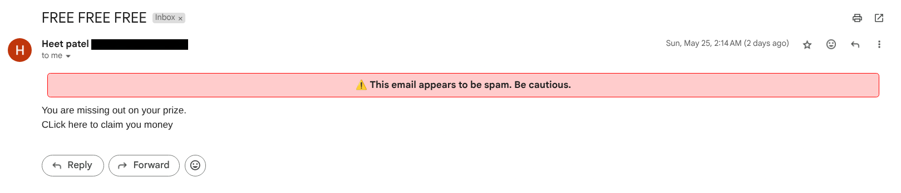

#  Email Spam Detector (Chrome Extension)

This browser extension automatically detects spam emails in Gmail as soon as you open an email, and alerts you directly on the page.

---

## Features
- Runs automatically in Gmail
- Analyzes email content using a trained ML model
- Instantly shows "Spam" or "Not Spam" with a banner
- No need to click anything!

---

## How it Works
- Uses a MutationObserver to detect when an email is opened
- Sends the email text to a backend API
- Displays the result as a floating popup banner inside Gmail

---

## Installation (Manual)
Follow these simple steps to use the extension:

1. **Download the ZIP**  
   Click the green **Code** button and select **Download ZIP**  

2. **Extract the ZIP**  
   Unzip the downloaded file to a folder on your computer.

3. **Open Chrome and go to Extensions**  
   Visit: `chrome://extensions/`

4. **Enable Developer Mode**  
   Toggle the switch in the top-right corner.

5. **Click "Load unpacked"**  
   Select the folder you extracted.

6. **Go to Gmail and open any email**  
   You’ll see a banner telling you whether the email is spam or safe!

---
 
Feel free to fork, improve, or share!

---

## Screenshot

